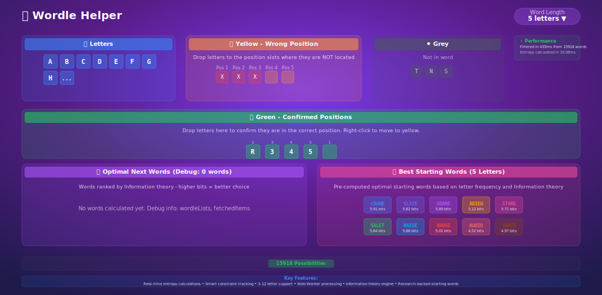

# 🎯 Wordle Helper# Getting Started with Create React App


**An intelligent, high-performance Wordle solving assistant powered by information theory and optimized algorithms.**This project was bootstrapped with [Create React App](https://github.com/facebook/create-react-app).


## Available Scripts


## ✨ FeaturesIn the project directory, you can run:


### 🧠 **Smart Word Analysis**### `npm start`

- **Information Theory Engine**: Calculates entropy values to find optimal word choices

- **Real-time Filtering**: Instant word filtering based on your guesses and constraintsRuns the app in the development mode.\

- **Pre-computed Starting Words**: Research-backed optimal starting words (CRANE, SLATE, SOARE, etc.)Open [http://localhost:3000](http://localhost:3000) to view it in the browser.

- **Multi-length Support**: Works with words from 1-31 letters (customizable word length)

The page will reload if you make edits.\

### ⚡ **High Performance**You will also see any lint errors in the console.

- **Web Workers**: Background processing ensures UI remains responsive

- **Ultra-fast Builds**: Powered by Rsbuild (0.1-0.2s rebuild times)### `npm test`

- **Optimized Algorithms**: Bit manipulation and efficient data structures

- **Smart Caching**: Intelligent word list caching for instant loadingLaunches the test runner in the interactive watch mode.\

See the section about [running tests](https://facebook.github.io/create-react-app/docs/running-tests) for more information.

### 🎨 **Modern UI/UX**

- **Drag & Drop Interface**: Intuitive letter placement with visual feedback### `npm run build`

- **Responsive Design**: Works perfectly on desktop and mobile devices

- **Smooth Animations**: Engaging interactions and visual transitionsBuilds the app for production to the `build` folder.\

- **Dark Theme**: Beautiful gradient-based cosmic designIt correctly bundles React in production mode and optimizes the build for the best performance.


### 🔧 **Developer Experience**The build is minified and the filenames include the hashes.\

- **TypeScript**: Full type safety and excellent developer experienceYour app is ready to be deployed!

- **Modern React**: React 19+ with hooks and functional components

- **Tailwind CSS**: Utility-first styling for rapid developmentSee the section about [deployment](https://facebook.github.io/create-react-app/docs/deployment) for more information.

- **ESLint & Prettier**: Code quality and consistency tools

### `npm run eject`

## 🚀 Quick Start

**Note: this is a one-way operation. Once you `eject`, you can’t go back!**

### Prerequisites

- Node.js 18+ and npmIf you aren’t satisfied with the build tool and configuration choices, you can `eject` at any time. This command will remove the single build dependency from your project.

- Modern web browser with Web Workers support

Instead, it will copy all the configuration files and the transitive dependencies (webpack, Babel, ESLint, etc) right into your project so you have full control over them. All of the commands except `eject` will still work, but they will point to the copied scripts so you can tweak them. At this point you’re on your own.

### Installation

You don’t have to ever use `eject`. The curated feature set is suitable for small and middle deployments, and you shouldn’t feel obligated to use this feature. However we understand that this tool wouldn’t be useful if you couldn’t customize it when you are ready for it.

```bash

# Clone the repository## Learn More

git clone https://github.com/MMALI3287/wordle-helper.git

cd wordle-helperYou can learn more in the [Create React App documentation](https://facebook.github.io/create-react-app/docs/getting-started).


# Install dependenciesTo learn React, check out the [React documentation](https://reactjs.org/).

npm install

# Start development server
npm run dev
```

The app will be available at `http://localhost:3001` (or the next available port).

### Production Build

```bash
# Create optimized production build
npm run build

# Preview production build locally
npm run preview
```

## 🎮 How to Use

1. **Set Word Length**: Choose your target word length (default: 5 letters)

2. **Enter Known Information**:
   - **Green Letters**: Drag letters to correct positions
   - **Yellow Letters**: Add letters that exist but are in wrong positions
   - **Gray Letters**: Add letters that don't exist in the word

3. **Get Suggestions**:
   - **Starting Words**: See optimal first guesses when you have no constraints
   - **Optimal Next Words**: Get entropy-ranked suggestions based on your constraints

4. **Refine Results**: The app automatically filters possible words and suggests the most informative next guesses

## 🏗️ Technical Architecture

### Core Technologies
- **Frontend**: React 19 + TypeScript + Tailwind CSS
- **Build Tool**: Rsbuild (next-generation bundler)
- **Background Processing**: Web Workers for non-blocking calculations
- **State Management**: React hooks with optimized re-rendering

### Performance Optimizations
- **Entropy Calculations**: Optimized JavaScript engine with bit manipulation
- **Memory Management**: Efficient data structures and garbage collection
- **Caching Strategy**: Multi-layer caching for word lists and calculations
- **Bundle Optimization**: Tree shaking and code splitting

### Algorithm Details
- **Information Theory**: Uses entropy calculations to measure information gain
- **Pattern Matching**: Efficient constraint checking with early termination
- **Word Filtering**: Optimized filtering algorithms for real-time results

## 📁 Project Structure

```
wordle-helper/
├── src/
│   ├── components/          # React components
│   ├── entropyWorker.ts     # Web Worker interface
│   ├── bestStartingWords.ts # Pre-computed starting words
│   ├── App.tsx             # Main application component
│   └── App.css             # Application styles
├── public/
│   ├── entropyWorker.js    # Web Worker implementation
│   └── words_*.json        # Word lists by length
├── build/                  # Production build output
└── docs/                   # Documentation files
```

## 🛠️ Development

### Available Scripts

- `npm run dev` - Start development server with hot reload
- `npm run build` - Create production build
- `npm run preview` - Preview production build locally
- `npm run lint` - Run ESLint for code quality checks
- `npm run type-check` - Run TypeScript compiler checks

### Development Guidelines

1. **Code Quality**: Follow TypeScript best practices and ESLint rules
2. **Performance**: Consider Web Worker usage for CPU-intensive tasks
3. **Accessibility**: Ensure keyboard navigation and screen reader support
4. **Testing**: Write unit tests for core algorithms and components

## 🔬 Algorithm Details

### Entropy Calculation
The app uses information theory to calculate the expected information gain for each possible guess:

```typescript
entropy = -Σ(p_i * log2(p_i))
```

Where `p_i` is the probability of each possible outcome pattern.

### Pattern Matching
Efficient pattern generation using:
- Bit manipulation for performance
- Early termination for constraint checking
- Optimized frequency counting

## 🤝 Contributing

Contributions are welcome! Please feel free to submit issues and pull requests.

### Development Setup
1. Fork the repository
2. Create a feature branch: `git checkout -b feature/amazing-feature`
3. Make your changes and test thoroughly
4. Commit with clear messages: `git commit -m 'Add amazing feature'`
5. Push to your branch: `git push origin feature/amazing-feature`
6. Open a Pull Request

## 📄 License

This project is licensed under the MIT License - see the [LICENSE](LICENSE) file for details.

## 🙏 Acknowledgments

- **Information Theory**: Based on research in optimal Wordle strategies
- **Starting Words**: Curated from computational analysis and community research
- **Performance Optimization**: Inspired by modern web development best practices

## 📊 Performance Metrics

- **Build Time**: ~0.4s (initial) / ~0.1-0.2s (rebuilds)
- **Bundle Size**: Optimized for fast loading
- **Entropy Calculation**: ~100-500ms for full word list analysis
- **UI Response**: <16ms for smooth 60fps interactions

---

**Made with ❤️ for Wordle enthusiasts and puzzle solvers**